# Project Versioning Plugin User Guide

## Purpose

**Project Versioning** is an Obsidian desktop plugin for creating complete ZIP snapshots of projects, comparing project versions, and generating human-readable audit reports.

A versioned project can be:
- the entire Obsidian vault;
- a folder inside the vault;
- an absolute folder elsewhere on the computer.

The plugin is intended for users who want understandable project-level versioning without requiring Git, Python, PowerShell, WinMerge, or another external comparison program.

## Core workflow

```text
Work on project
    ↓
Archive & Compare
    ↓
New ZIP snapshot
    ↓
Previous snapshot identified
    ↓
Changes compared
    ↓
Markdown and JSON reports
    ↓
Version history updated
```

The plugin can:
- create complete ZIP snapshots;
- assign automatic date/version filenames;
- compare each new snapshot with the preceding snapshot;
- compare any two existing snapshots;
- detect added, deleted, modified, moved, and renamed files;
- produce line-by-line diffs for text files;
- detect changes to binary files by content hash;
- distinguish substantive changes from metadata-only and generated/derived changes;
- manage old snapshots;
- apply configurable retention policies;
- export snapshots to another folder for convenient access;
- maintain human-readable Markdown reports and machine-readable JSON reports.

---

# 1. Project Versioning Settings

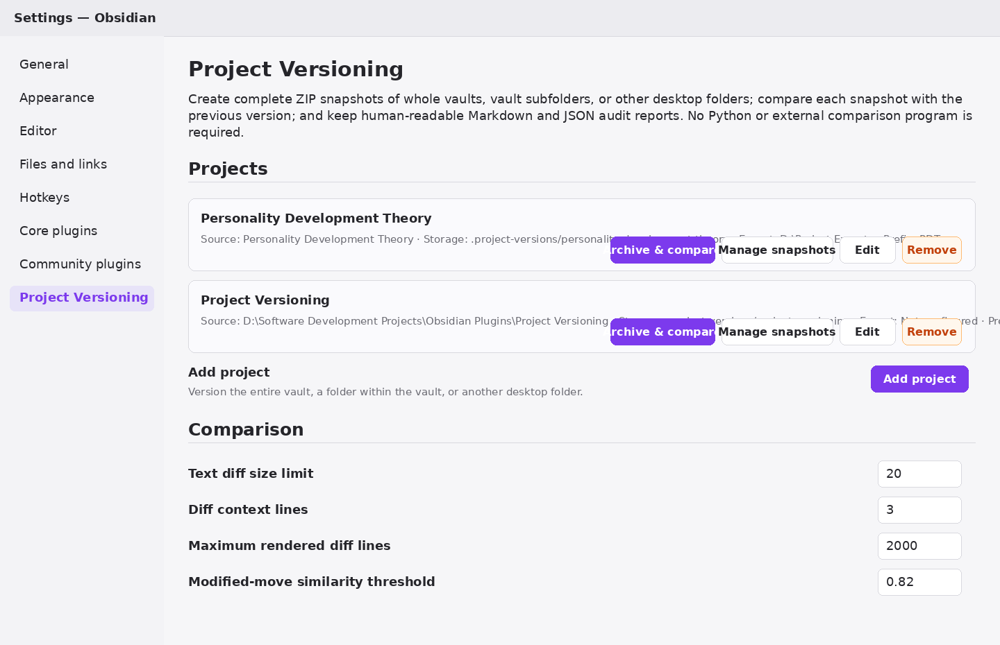

Open:

```text
Settings → Project Versioning
```

The Settings screen is the main administrative interface.

It contains:
- configured projects;
- project-specific action buttons;
- global comparison settings;
- snapshot-management information;
- storage and privacy information.

## Configured projects

Each project row displays:
- **Source** — folder being versioned;
- **Storage** — location of managed snapshots and reports;
- **Export** — optional location receiving convenient snapshot copies;
- **Prefix** — filename prefix used for snapshots.

Example:

```text
Source: Personality Development Theory
Storage: .project-versions/personality-development-theory
Export: D:\Project Exports
Prefix: PDT
```

Each project provides four principal actions.

### Archive & compare

Creates a new ZIP snapshot.

If an earlier snapshot exists, the new snapshot is automatically compared with it.

Example:

```text
PDT - 2026-08-20 V1.zip
PDT - 2026-08-20 V2.zip
```

When `V2` is created, the plugin compares it with `V1`.

### Manage snapshots

Opens the Snapshot Manager for inspecting, deleting, exporting, and thinning stored versions.

### Edit

Opens the project definition so that paths and other settings can be changed without losing the project's existing version history.

### Remove

Opens a removal dialog with separate choices:
- **Remove only** removes the project definition and preserves managed snapshots and reports.
- **Remove + delete data** permanently deletes the project's managed snapshots and reports, then removes the project definition.

The actual project source folder is never deleted by either option.

---

# 2. Add or Edit Project

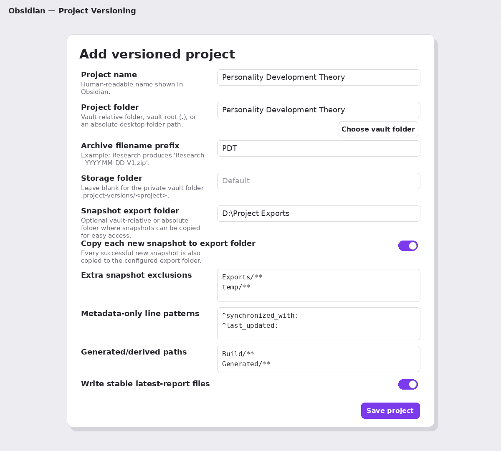

The same dialog is used for:
- creating a new versioned project;
- editing an existing project.

## Project name

Human-readable project name displayed throughout the plugin. Because the project name is also the default snapshot filename prefix, it must be safe as a cross-platform filename component. Project Versioning rejects Windows-reserved filename characters (`< > : " / \ | ? *`), control characters, leading or trailing whitespace, trailing periods, `.`/`..`, and reserved Windows device names such as `CON`, `NUL`, `COM1`, and `LPT1`. Valid Unicode and ordinary punctuation such as brackets, `@`, `#`, `&`, parentheses, hyphens, and underscores are allowed. Existing projects created by an older version are preserved exactly, but snapshot creation will require the name to be corrected if it violates these rules.

Examples:

```text
Personality Development Theory
Project Versioning
Dream Research
```

## Project folder

The folder whose contents are included in snapshots.

Allowed forms include:

### Entire vault

```text
.
```

### Vault-relative folder

```text
20 - Projects/Personality Development Theory
```

### Absolute desktop folder

```text
D:\Research\Personality Development Theory
```

The path can still be typed or pasted directly. While typing, Project Versioning suggests up to six valid matching folders from the current path level; typing a separator moves completion into the next level. Folders that are invalid for the current field are omitted rather than shown as disabled choices. Arrow keys move through suggestions, Enter or Tab accepts one, and Esc dismisses the list. Folder controls are also available:
- **Open** opens the currently resolved existing folder in the operating system file manager.
- **Vault...** opens the searchable vault-folder picker and stores a vault-relative path.
- **Browse...** opens the filesystem folder browser and can select folders anywhere on the computer. If the selected folder is inside the vault, Project Versioning stores it as a vault-relative path.

A live status below the field confirms when the folder exists or reports a blocking path error. If the same source folder is already configured as another active project, the folder is rejected and the project cannot be saved until a different source folder is chosen. For a new project, explicitly choosing a source folder also initializes **Project name** from that folder name until the project name is manually edited.

## Archive filename prefix

Controls the beginning of snapshot filenames.

For example:

```text
PDT
```

produces:

```text
PDT - 2026-08-20 V1.zip
PDT - 2026-08-20 V2.zip
```

If left blank, the setting remains blank and new snapshots use the **current project name** as their prefix. An explicit prefix uses the same filename-safety validation as the project name. Invalid characters are rejected rather than silently replaced.

Changing the prefix affects **new snapshot filenames only**. Existing snapshots remain part of the same project history and keep their original filenames; version numbering continues across the prefix change.

## Storage folder

Defines the plugin's managed snapshot-storage location.

If left blank, the default is:

```text
<Vault>\.project-versions\<project-id>\
```

For example:

```text
<Vault>\.project-versions\pdt\
```

This hidden location is normally preferable because it keeps versioning files separate from project content.

A vault-relative or absolute path can also be entered manually. The field provides compact path-aware autocomplete plus **Default**, **Open**, **Vault...**, and **Browse...** actions. Focusing the field shows valid visible folders at the current level; typing narrows the list hierarchically. **Default** clears a custom location and returns the project to its stable private `.project-versions/<project-id>` storage. Moving to custom storage and later returning to Default does not create a numbered replacement folder. The filesystem browser can select an empty destination folder, which is useful when migrating managed storage.

Custom managed storage is deliberately isolated. It cannot be the same as, inside, or contain the project source; it cannot overlap any other active project source; and managed-storage trees cannot overlap one another, including parent/child relationships with active or retained project storage. Custom paths inside hidden vault folders are rejected. Windows system folders such as `$RECYCLE.BIN` and `System Volume Information` are also unavailable. If the entire vault is versioned, automatic default storage remains permitted because `.project-versions` is a protected internal namespace excluded from snapshots.

The editor validates managed storage before Save. A configured folder may be created when needed, but a storage migration destination must be empty. If a removed project retained default managed history and the same source folder is later re-added with default storage, the retained project identity is reused so the old history remains on the same lineage.

## Snapshot export folder

Optional folder where snapshots can be copied for convenient access. The path supports hierarchical autocomplete and can also be controlled with **Open**, **Vault...**, or **Browse...**. Live validation shows whether the folder exists or will be created when needed.

Example:

```text
D:\Project Exports
```

This allows the plugin to keep its authoritative managed archive in hidden storage while also making selected ZIP files easily accessible to the user.

Typical reasons for using an export folder include:
- sending a project snapshot to another person;
- uploading a snapshot to ChatGPT or another service;
- copying a milestone version to external storage;
- keeping selected ZIPs in an easily visible location.

The distinction is:

```text
Managed storage
→ authoritative plugin-controlled snapshots

Export folder
→ optional convenient copies
```

## Copy each new snapshot to export folder

This setting is visible only while a valid **Snapshot export folder** is configured. When enabled, every successfully created snapshot is automatically copied to that folder. Clearing the export-folder path automatically disables and hides this setting.

The managed version remains in Project Versioning storage.

If this setting is disabled, snapshots can still be exported manually.

## Extra snapshot exclusions

One glob pattern per line.

These patterns prevent specified files or folders from entering snapshots.

Examples:

```text
Exports/**
temp/**
build/**
```

This is useful for:
- generated files;
- temporary files;
- large irrelevant folders;
- external exports;
- other data that should not be versioned.

## Metadata-only line patterns

Optional regular expressions identifying changes that should be classified as metadata-only.

Example:

```text
^synchronized_with:
^last_updated:
^version:
```

A modified text file is classified as metadata-only only when every changed nonblank line matches one of the configured patterns.

This helps distinguish changes such as:

```diff
- synchronized_with: PDT-8.12
+ synchronized_with: PDT-8.13
```

from genuine substantive changes to the document.

## Generated/derived paths

Glob patterns identifying generated or derived files.

Examples:

```text
Build/**
Generated/**
Exports/**
```

Changes to these files remain recorded but can be classified separately from substantive project modifications.

## Write stable latest-report files

When enabled, Project Versioning maintains stable report filenames such as:

```text
Latest Comparison Report.md
Latest Comparison Report.json
```

This is useful because another Obsidian note can refer permanently to:

```text
[[Latest Comparison Report]]
```

without needing to know the most recent version number.

---

# 3. Snapshot Retention Settings

The lower part of the Add/Edit Project dialog configures retention.

Retention is disabled by default. While it is disabled, only the **Enable retention policy** control is shown. Enabling retention reveals the retention mode and automatic-cleanup control. Only the options required by the selected retention mode are then shown.

The newest snapshot is always protected.

## Enable retention policy

Allows the plugin to calculate which older snapshots may be removed according to the selected strategy.

## Retention mode

Four modes are available. Changing the mode immediately replaces the mode-specific fields shown below it.

### Keep everything

No snapshot is removed by retention.

### Keep latest N snapshots

Example:

```text
Keep latest: 20
```

Only the newest 20 snapshots are retained when cleanup is applied.

### Keep snapshots from last N days

Example:

```text
Retention age: 90 days
```

Snapshots within the selected age window are retained.

The newest snapshot remains protected even if it falls outside the stated period.

### Tiered: recent + daily + weekly

Designed for long-running projects with frequent snapshots.

Conceptually:

```text
Newest snapshots
→ keep every snapshot

Older snapshots
→ keep one per day

Still older snapshots
→ keep one per week
```

This prevents numerous snapshots from one intensive work session from consuming storage indefinitely while preserving a meaningful long-term project history.

## Latest snapshots to keep

Used by **Keep latest N snapshots**.

Minimum:

```text
1
```

## Retention age in days

Used by **Keep snapshots from last N days**.

## Tiered recent snapshots

Number of newest snapshots retained in full.

Example:

```text
10
```

means the most recent ten snapshots are all preserved.

## Tiered daily window

Number of days during which one older snapshot per day is retained.

Beyond this window, tiered retention keeps approximately one snapshot per week.

## Clean up automatically after new snapshot

If enabled, the retention policy is applied automatically after a successful archive-and-compare operation.

For cautious operation, it is reasonable to leave this disabled initially and apply retention manually through **Manage snapshots**.

---

# 4. Choose Folders

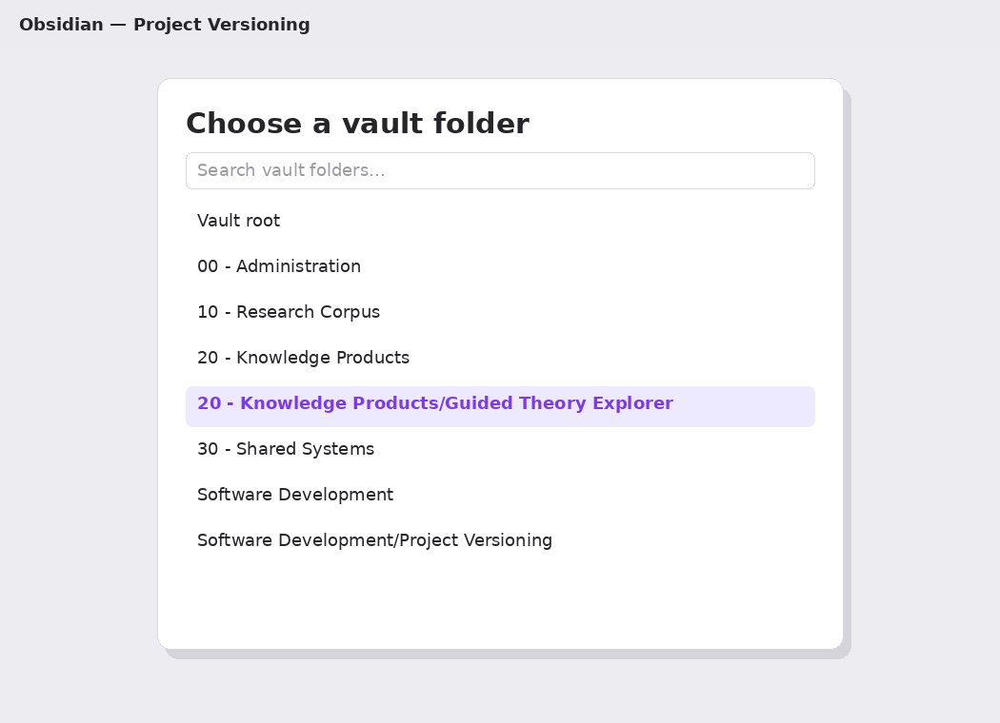

Folder-location fields retain editable text boxes and also provide selectors.

## Vault folder selector

Click **Vault...** to choose a folder inside the current vault.

It lists:
- Vault root where that field permits it;
- folders inside the vault;
- nested subfolders.

The list is searchable. Selecting a folder inserts its vault-relative path into the field.

## Filesystem folder selector

Click **Browse...** to browse the computer's filesystem. The browser:
- shows the complete **Current folder** path without truncating it;
- uses **Parent folder** for upward navigation and **Choose drive** on Windows, listing only drive roots that currently exist and can be read;
- single-clicks a child folder to select it and double-clicks or presses Enter to open it;
- uses **Use current folder** or **Use selected folder** to confirm the choice;
- allows empty folders to be selected;
- hides dot-prefixed internal folders and known Windows system folders rather than offering them as choices;
- validates storage candidates inside the browser and disables the Use action for unsafe choices;
- clears stale folder rows and disables the Use action if the current location does not exist or cannot be accessed;
- inserts an absolute path for folders outside the vault;
- converts folders inside the vault to vault-relative paths.

Direct path entry belongs in the main Add/Edit Project form. The Browse dialog is intentionally limited to visual navigation.

The filesystem selector is available for **Project folder**, **Storage folder**, and **Snapshot export folder**. Each of these fields also has an **Open** action when its resolved folder already exists.

---

# 5. Choose Project

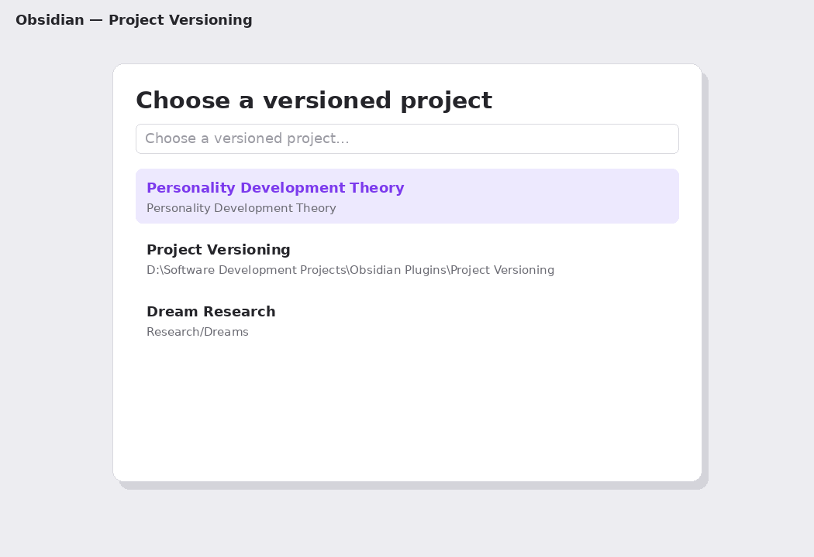

Several commands operate on a particular project.

When more than one project is available, Project Versioning opens the project picker.

Each entry shows:
- project name;
- source path.

The picker can be filtered by typing.

It is used by commands such as:
- Archive and compare project;
- Compare latest snapshots;
- Compare chosen snapshots;
- Manage snapshots;
- Edit versioned project;
- Export latest snapshot;
- Export chosen snapshot.

---

# 6. Archive and Compare

The principal daily command is:

```text
Archive and compare project
```

The same operation is available through the project's **Archive & compare** button.

The plugin performs the following sequence:

```text
Read current project
        ↓
Create ZIP snapshot
        ↓
Determine automatic version
        ↓
Hash archive contents
        ↓
Identify previous snapshot
        ↓
Compare project states
        ↓
Generate reports
        ↓
Update Version History
        ↓
Optionally export ZIP
        ↓
Optionally apply retention
```

## Automatic filenames

Snapshots use:

```text
PREFIX - YYYY-MM-DD Vn.zip
```

Example:

```text
PDT - 2026-08-20 V1.zip
PDT - 2026-08-20 V2.zip
PDT - 2026-08-20 V3.zip
```

On a new date:

```text
PDT - 2026-08-21 V1.zip
```

The version counter therefore represents multiple snapshots created on the same date.

---

# 7. Choose Snapshot

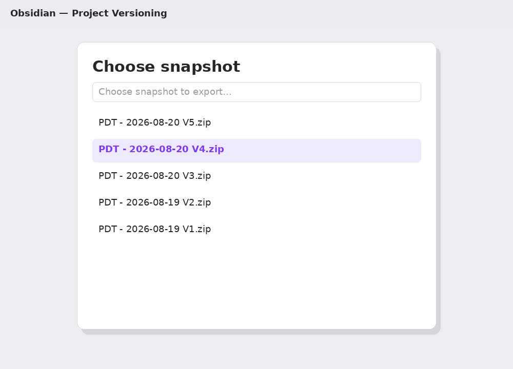

This searchable dialog appears when a particular stored snapshot must be selected.

Examples:
- comparing two chosen snapshots;
- exporting an older snapshot.

Entries are displayed by archive filename.

Example:

```text
PDT - 2026-08-19 V2.zip
PDT - 2026-08-20 V1.zip
PDT - 2026-08-20 V2.zip
```

---

# 8. Comparison Reports

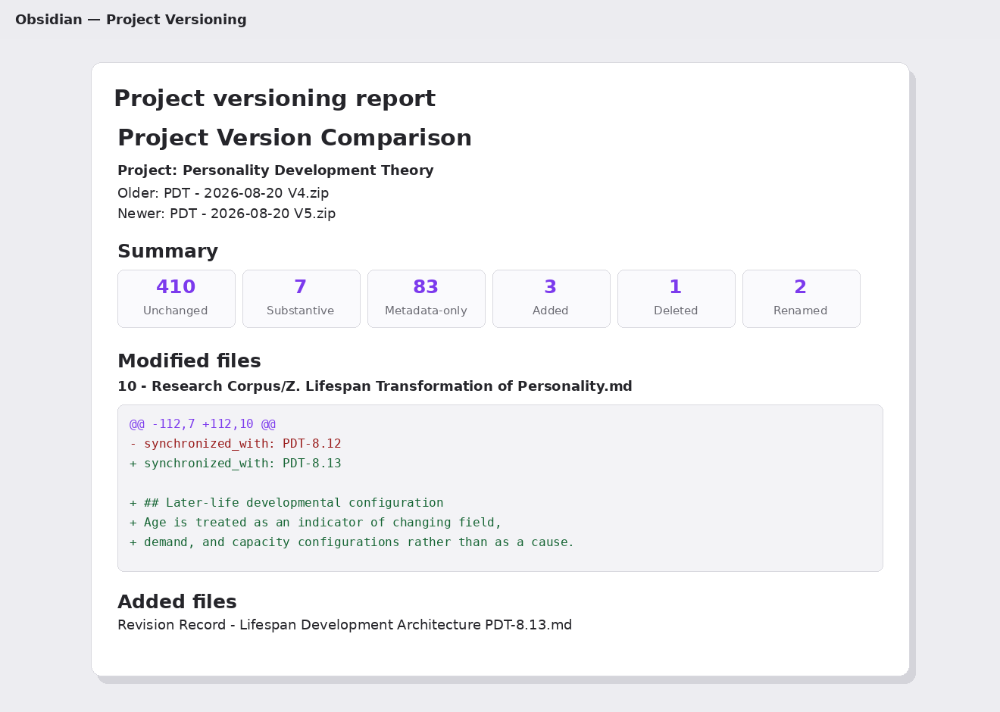

Project Versioning produces Markdown and JSON comparison reports.

The Markdown report is designed primarily for human inspection.

It can show:
- compared snapshot names;
- file counts;
- unchanged files;
- modified files;
- added files;
- deleted files;
- exact moves and renames;
- probable moved-and-modified files;
- substantive modification counts;
- metadata-only modification counts;
- generated/derived modification counts;
- line-by-line text differences.

A typical summary might resemble:

```text
Unchanged: 410
Substantive modifications: 7
Metadata-only modifications: 83
Generated modifications: 2
Added: 3
Deleted: 1
Renamed: 2
```

## Text diffs

Changed text files receive line-level comparisons when they fall below the configured size limit. In the Obsidian comparison-report view, paired removed and added lines also highlight the exact changed characters more strongly, which keeps small edits visible even inside very long generated lines. The saved Markdown report itself remains a standard unified diff.

Example:

```diff
- synchronized_with: PDT-8.12
+ synchronized_with: PDT-8.13
```

Larger files are still detected as changed even when full line-by-line rendering is suppressed.

## Binary files

Binary files are compared by content.

Project Versioning can therefore detect that an image, PDF, ZIP, or other binary file changed even though it cannot render a meaningful textual diff.

---

# 9. Global Comparison Settings

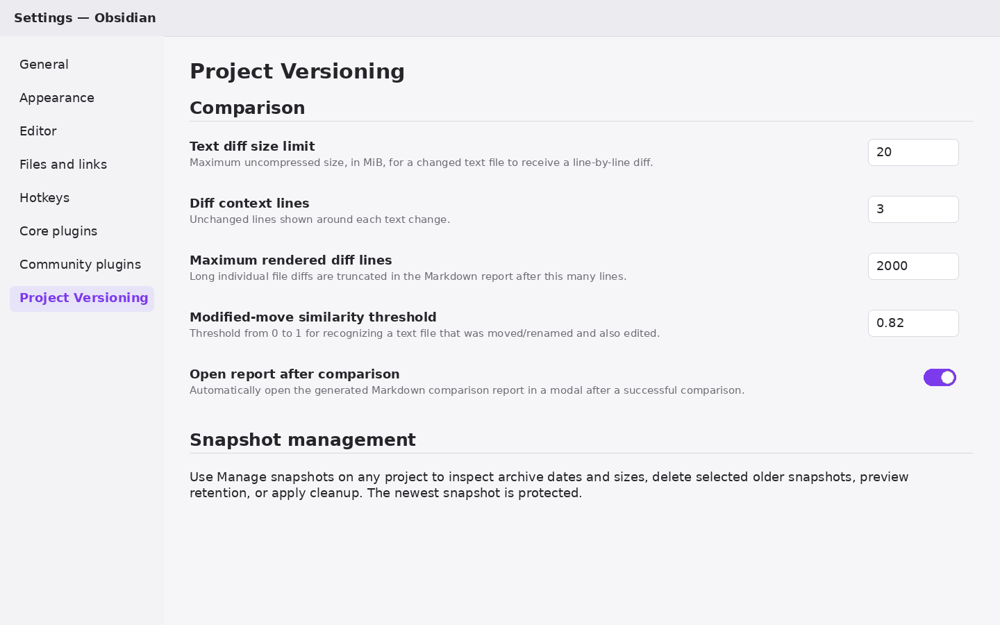

These settings apply across projects.

## Text diff size limit

Maximum uncompressed text-file size, in MiB, that receives a line-by-line diff.

Files above the limit are still:
- hashed;
- recognized as changed;
- included in reports.

The limit only controls detailed rendered diff generation.

## Diff context lines

Controls how many unchanged lines appear around each change.

Example:

```text
3
```

shows three unchanged surrounding lines where appropriate.

## Maximum rendered diff lines

Limits the amount of diff text emitted for a single changed file.

This prevents extremely large file changes from creating enormous Markdown reports.

The comparison itself remains complete even when displayed diff output is truncated.

## Modified-move similarity threshold

Controls recognition of files that were:
- moved or renamed;
- and edited at the same time.

The value ranges from:

```text
0.5
```

to:

```text
1.0
```

Higher values require stronger similarity before the plugin treats two files as likely versions of the same moved document.

## Open report after comparison

When enabled, the generated Markdown report opens automatically after a successful comparison.

---

# 10. Manage Snapshots

Open through:
- **Manage snapshots** beside a project;
- the `Manage snapshots` command.

The Snapshot Manager is the main archive-maintenance interface.

At the top it displays:
- number of stored snapshots;
- total disk space used.

A snapshot table shows:
- a selection checkbox for deletable older snapshots;
- snapshot filename;
- creation date and time;
- file size;
- status.

## Snapshot status

The newest snapshot appears as:

```text
Latest · protected
```

Older snapshots appear as:

```text
Available
```

The newest snapshot cannot be selected for deletion. Its selection cell is intentionally empty rather than showing a disabled checkbox, because the protected snapshot is not an available deletion target.

## Delete selected

Select one or more older snapshots and click:

```text
Delete selected
```

The interface displays:
- number selected;
- approximate space that would be recovered.

Deletion requires confirmation.

## Remove duplicates

Click:

```text
Remove duplicates
```

to scan the stored snapshots for redundant consecutive copies.

A duplicate is defined by the logical project contents, not by the ZIP file bytes: every archived file path and file content must be identical to the immediately following snapshot. The older redundant copy is selected for removal and the newest copy in each unchanged run is retained.

Non-consecutive repeated states are deliberately preserved. For example, if the project changes from state A to state B and later returns to state A, the later A snapshot is not removed merely because it matches the earlier historical state.

The plugin shows the number of duplicates and approximate recoverable space before deletion. Removal requires confirmation and uses the same report/history cleanup safeguards as ordinary snapshot deletion.

## Apply retention policy

Applies the project's configured retention rules.

The button is enabled only when:
- retention is enabled;
- the retention mode permits deletion;
- the current snapshot set contains versions eligible for removal.

## Retention preview

The Snapshot Manager shows the expected result before cleanup.

Example:

```text
Retention preview:
keep 18
delete 27
reclaim 642 MiB
```

It also states whether automatic cleanup after snapshots is enabled.

---

# 11. Delete Snapshots Confirmation

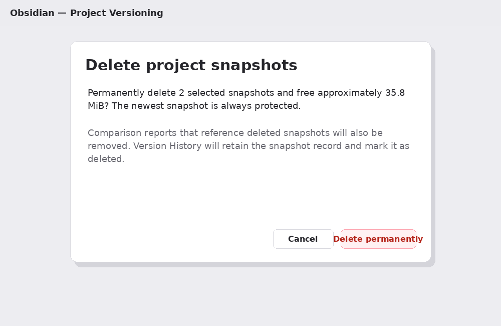

Before permanent deletion, Project Versioning presents a confirmation dialog.

It reports:
- number of snapshots selected;
- approximate disk space recovered;
- protection of the newest snapshot.

It also explains that:
- comparison reports referencing deleted snapshots may be removed;
- Version History retains the historical record;
- deleted snapshots are marked accordingly.

Buttons:

```text
Cancel
Delete permanently
```

---

# 12. Apply Retention Policy Confirmation

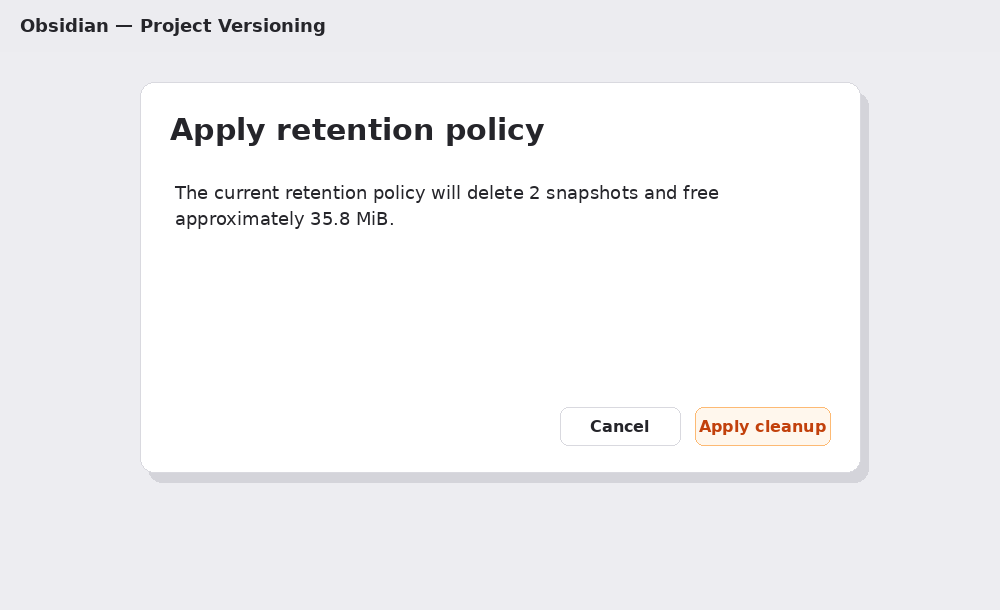

Before retention cleanup, Project Versioning reports:
- number of snapshots to be deleted;
- approximate storage to be recovered.

Buttons:

```text
Cancel
Apply cleanup
```

This provides a final opportunity to inspect the effect before older archives are removed.

---

# 13. Exporting Snapshots

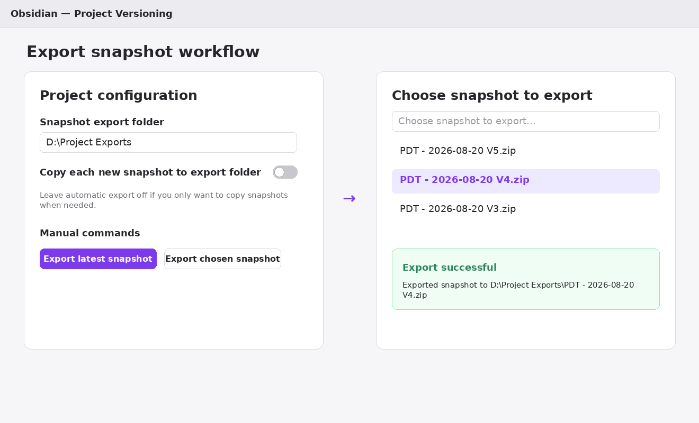

Managed snapshot storage is intentionally separate from user-accessible export copies.

Three export mechanisms are available.

## Export latest snapshot

Copies the newest stored snapshot to the project's configured **Snapshot export folder**.

Typical use:

```text
Archive & Compare
        ↓
Export latest snapshot
        ↓
D:\Project Exports\PDT - 2026-08-20 V3.zip
```

## Export chosen snapshot

Opens the snapshot picker and copies the selected historical snapshot to the export folder.

This is useful when a specific older version must be:
- uploaded;
- shared;
- moved elsewhere;
- archived separately.

## Automatic snapshot export

Enable:

```text
Copy each new snapshot to export folder
```

in the project settings.

Every successful new snapshot is then automatically copied to the configured export location.

## Export filename collisions

Project Versioning never silently overwrites an existing export file.

- If the destination filename does not exist, the snapshot is copied normally.
- If the destination filename already exists and its contents are identical to the managed snapshot, Project Versioning reports that the snapshot is already present and leaves the existing file unchanged.
- If the destination filename already exists with different contents, export is refused and the existing file is preserved.

Project Versioning does not automatically rename the new export with `(1)` or a similar suffix because exported filenames should continue to identify the corresponding managed snapshot unambiguously.

## Managed archive versus exported copy

The managed archive remains authoritative.

```text
.project-versions
        ↓
managed snapshot

D:\Project Exports
        ↓
convenience copy
```

Deleting or moving an exported copy does not remove the managed snapshot.

---

# 14. Editing a Project

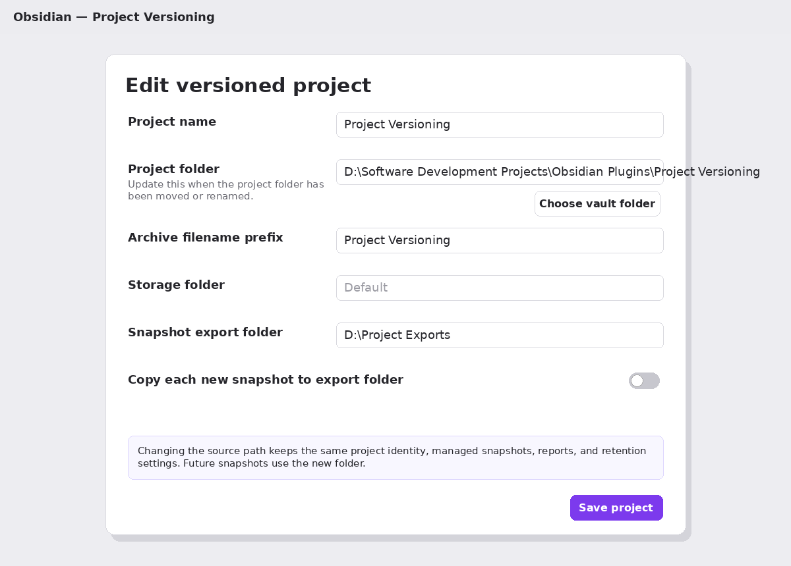

## Save-state and validation behavior

When an existing project opens with no effective changes, **Save project** is disabled. It becomes enabled only after a real setting change and only while all blocking validation checks pass. Equivalent path spellings, such as a harmless trailing separator, do not count as changes. Reverting all changes disables Save again.

The path fields are checked while you edit them:
- the project source must already exist and be a folder;
- missing storage or export folders may be created when needed;
- custom managed storage cannot overlap its own source tree or any other active project source tree;
- managed-storage trees cannot overlap one another, including parent/child relationships;
- custom storage cannot use the internal `.project-versions` namespace;
- a new storage destination for migration must be empty;
- duplicate source folders already used by an active project are blocking errors.

If you close the Add/Edit Project dialog after making unsaved effective changes, Project Versioning asks whether to **Continue editing** or **Discard changes**.

Projects can be edited through:
- **Edit** beside the project in Settings;
- the `Edit versioned project` command.

Editing is particularly important when a project's folder is renamed or moved.

Example:

Original path:

```text
D:\Research\Personality Development Theory
```

New path:

```text
D:\Projects\PDT
```

Procedure:
1. Open Project Versioning.
2. Choose **Edit**.
3. Change **Project folder**.
4. Click **Save project**.

The project retains:
- its project identity;
- existing snapshots;
- comparison history;
- retention settings;
- storage location;
- export configuration.

Future snapshots use the new source path.

It is therefore normally preferable to **edit the project rather than remove and recreate it**.

---

# 15. Remove Versioned Project

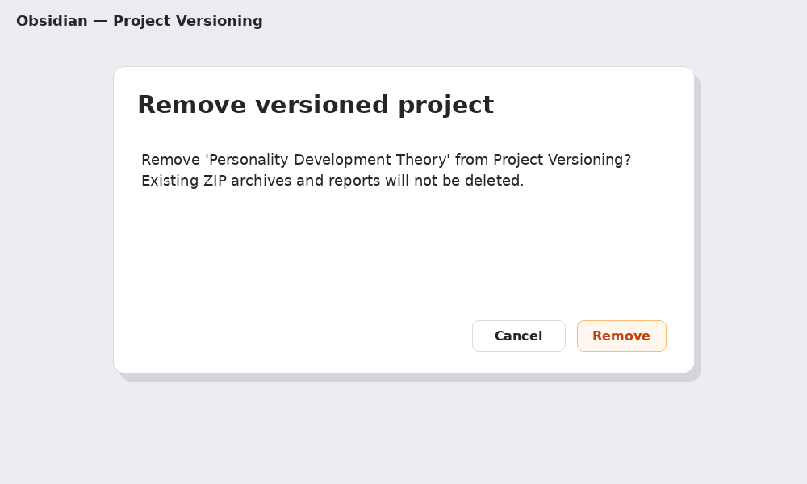

Clicking **Remove** opens a confirmation dialog that separates removal of the project definition from deletion of Project Versioning's stored data.

## Remove only

**Remove only** removes the project definition from Project Versioning.

It does **not** delete:
- the actual project folder or any project files;
- managed ZIP snapshots;
- comparison reports;
- version history;
- exported snapshot copies.

Use this when you want Project Versioning to stop actively managing the project but want to retain the existing version archive. The removed project appears under **Retained versioning data** in Settings so its managed data can still be deleted later without having to locate hidden folders manually.

## Remove + delete data

**Remove + delete data** permanently deletes the selected project's managed:
- `archives/` folder;
- `reports/` folder;

and then removes the project definition.

The actual project source folder is never deleted or modified.

If a custom managed-storage folder contains unrelated files or folders, those entries are preserved. The storage folder itself is removed only when it becomes empty after Project Versioning's managed data has been deleted.

## Exported snapshot copies

Exported copies are ordinary user-facing files and are preserved by default. If the project currently has an export folder configured, the removal dialog offers:

**Also delete known exported snapshot copies**

When enabled, Project Versioning removes only snapshot filenames known from the project's managed archive or Version History and only from the currently configured export folder.

It does not automatically delete:
- renamed exported copies;
- copies moved elsewhere;
- copies in a previously configured export folder;
- unrelated files in the export folder.

## Delete all stored versioning data

A global cleanup control is available under:

```text
Settings → Project Versioning → Storage and privacy
→ Delete all stored versioning data
```

This operation permanently deletes managed snapshots and reports for every active project and every retained data record from a previously removed project. It also scans the default `.project-versions` namespace for orphaned managed `archives/` and `reports/` data left by older plugin versions, while preserving:
- every project source folder;
- every project file;
- all project definitions and settings.

The **Delete stored data...** button is disabled when there are no managed archives or reports to delete.

It is intended for cases such as cleaning up Project Versioning data before uninstalling the plugin. If Project Versioning remains installed, active projects stay configured, but their next snapshot begins a new version history.

The global confirmation dialog can optionally delete known exported snapshot copies from each project's currently configured export folder.

## Uninstall behavior

Disabling or uninstalling Project Versioning does **not** automatically delete `.project-versions` or external managed-storage folders.

This is intentional: snapshot archives may be the user's only remaining version history, and uninstalling a plugin should not silently destroy them.

If you want the plugin-created managed data removed before uninstalling, use **Delete all stored versioning data** first.

The distinction is therefore:

```text
Remove only
→ remove project configuration
→ keep versioning data

Remove + delete data
→ delete that project's managed versioning data
→ remove project configuration

Delete all stored versioning data
→ delete managed versioning data for all configured projects
→ keep project configurations

Uninstall plugin
→ remove plugin itself
→ stored versioning data remains unless explicitly cleaned up first
```

---

# 16. Version History

Project Versioning maintains a persistent historical record. **Open version history** presents the record in a compact five-column table:
- **Snapshot** — archive filename;
- **Created** — local creation time in sortable `YYYY-MM-DD_HH:mm_DDD` format, for example `2026-08-28_00:44_FRI`;
- **Previous** — preceding snapshot used for comparison;
- **Status** — for example `Available` or the date on which a retained history entry was deleted;
- **Changes** — a compact summary such as `1 modified · 2 added`.

Expand **Changes** to inspect:
- total file count;
- substantive modification count;
- metadata-only modification count;
- generated-only modification count;
- additions;
- deletions;
- archive SHA-256.

The header remains visible while the history is scrolled. Long snapshot names are kept to one line and can be inspected through their tooltip instead of forcing the table to expand horizontally.

Existing Version History files from earlier releases are upgraded automatically. When the old ZIP still exists, its filesystem timestamp supplies the exact creation time. If a legacy history entry refers to an archive that has already been deleted, the plugin preserves the recoverable date and weekday but displays the time as unavailable rather than inventing one.

This allows historical project states to remain documented even if an older ZIP is eventually removed under a retention policy.

---

# 17. Default Hidden Storage

By default, Project Versioning stores data under:

```text
<Vault>\.project-versions\
```

Each project has its own subfolder:

```text
.project-versions\
├── pdt\
├── dream-research\
└── project-versioning\
```

This location is deliberately hidden from the normal Obsidian File Explorer.

Users manage it through:
- Project Versioning Settings;
- Manage snapshots;
- retention controls;
- export controls.

This avoids cluttering the knowledge vault with archive infrastructure.

The hidden folder is persistent data, not a temporary cache. It is therefore not automatically removed when Project Versioning is disabled or uninstalled. Use the explicit cleanup controls described in Section 15 if the stored versioning data should be deleted.

---

# 18. Storage Safety

If managed storage or an export location lies inside the source project, Project Versioning excludes the appropriate paths from snapshots where necessary.

This prevents recursive behavior such as:

```text
Snapshot V1
        ↓
included inside Snapshot V2
        ↓
V1 + V2 included inside V3
```

Such recursion would cause rapidly increasing archive sizes.

Project Versioning is designed to prevent this.

---

# 19. Privacy, Network Behavior, and External File Access

Project Versioning performs its versioning locally.

The plugin does not require:
- an account;
- Python;
- an external comparison service;
- cloud storage;
- telemetry;
- advertising;
- network upload.

## External filesystem access

External filesystem access is optional and occurs only when the user explicitly selects or enters a path outside the current vault.

Project Versioning can access three types of external location:
- **Project folder:** an external desktop project can be read as the versioning source.
- **Storage folder:** snapshots and comparison reports can be written to a user-selected folder outside the vault.
- **Snapshot export folder:** user-requested copies of snapshot ZIP files can be written to a user-selected external folder.

The principal reason for external managed storage is to allow version archives to be physically separated from the Obsidian vault. This can prevent large ZIP archives from being included in vault synchronization and can place the version history on a different storage location from the source project.

Project Versioning does not scan arbitrary drives or unrelated folders. It reads or writes outside the vault only through paths that the user explicitly configures.

## External deletion boundaries

When managed storage is external, cleanup is restricted to Project Versioning's managed `archives/` and `reports/` subfolders. Unrelated files in the selected storage folder are preserved.

Known exported snapshot copies are deleted only when the user explicitly enables the corresponding option in a destructive cleanup dialog.

The actual project source folder is never deleted by Project Versioning cleanup operations, whether the project is inside or outside the vault.

---

# 20. Recommended Everyday Workflow

For active project development:

```text
Edit project
        ↓
Archive & Compare
        ↓
Inspect report
        ↓
Accept current state
        ↓
Continue work
```

For AI-assisted project revisions:

```text
Authoritative project
        ↓
Provide project to AI
        ↓
Receive revised project
        ↓
Archive & Compare
        ↓
Inspect exact differences
        ↓
Accept or reject revisions
```

For important milestones:

```text
Archive & Compare
        ↓
Export latest snapshot
        ↓
Copy/share milestone ZIP
```

---

# 21. Recommended Retention Strategy

For projects receiving only occasional snapshots:

```text
Keep everything
```

may be appropriate.

For heavily developed projects, tiered retention can preserve useful history while reducing redundant versions.

Example:

```text
Keep:
10 newest snapshots
+
1 snapshot per day for 30 days
+
1 snapshot per week thereafter
```

This preserves detailed recent development while gradually reducing historical storage density.

Automatic cleanup can remain disabled until the user is comfortable with the retention behavior.

---

# 22. Troubleshooting

## Project still points to an old folder

Open:

```text
Settings → Project Versioning → Edit
```

and update **Project folder**.

Save the project before creating the next snapshot.

## Snapshot cannot be created

Verify:
- the project source folder exists;
- the configured path is correct;
- storage is writable;
- custom storage is outside every versioned source tree and does not contain one;
- custom storage does not overlap another active or retained managed-storage tree;
- custom storage is not inside `.project-versions` (leave the field blank to use default storage).

## Export does not work

Verify:
- a Snapshot export folder is configured;
- the export folder exists or can be created;
- the folder is writable;
- no different file already occupies the intended snapshot filename in the export folder.

For automatic export also verify:

```text
Copy each new snapshot to export folder
```

is enabled.

## Retention does not delete snapshots

Verify:
- retention is enabled;
- the retention mode is not **Keep everything**;
- enough older snapshots exist to satisfy the retention rule.

## Newest snapshot cannot be deleted

This is intentional.

The current newest snapshot is always protected from snapshot-management deletion.

## Comparison report is extremely large

Reduce:

```text
Maximum rendered diff lines
```

or lower:

```text
Text diff size limit
```

The plugin will still detect changed files even when detailed display output is restricted.

---

# 23. Command Reference

Project Versioning provides commands for:

```text
Add versioned project
Archive and compare project
Compare latest snapshots
Compare chosen snapshots
Open latest comparison report
Open version history
Manage snapshots
Edit versioned project
Export latest snapshot
Export chosen snapshot
```

Commands can be invoked through the Command Palette (`Ctrl+P` on Windows/Linux or `Cmd+P` on macOS).

and can optionally be assigned hotkeys through:

```text
Settings → Hotkeys
```

---


# Conclusion

Project Versioning provides a snapshot-based approach to project history:

```text
Complete project state
        ↓
Named ZIP snapshot
        ↓
Next project state
        ↓
Comparison
        ↓
Human-readable audit trail
```

Its primary objective is not merely backup.

The plugin is designed to answer:

> **What exactly changed between two complete states of this project?**

At the same time, its snapshot manager, retention system, export functionality, project editing, and version history make it practical as a long-term project-versioning system entirely within Obsidian.